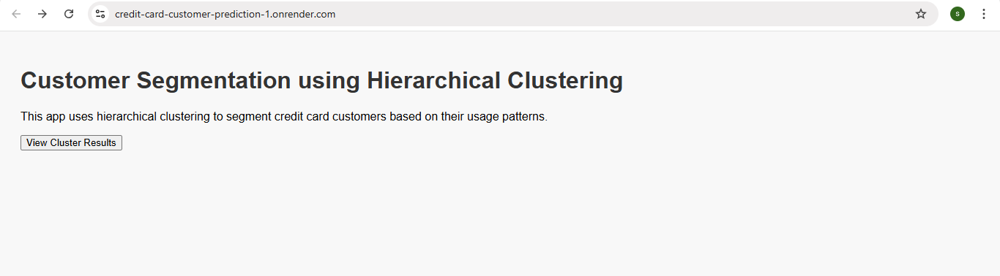
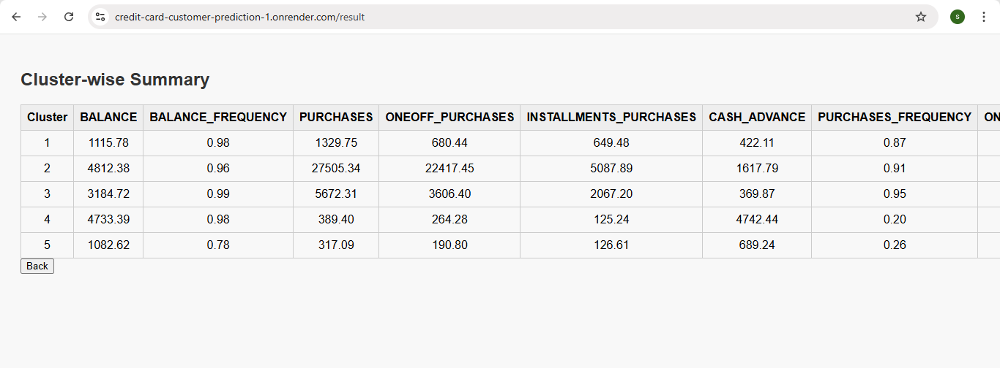

# credit-card-customer-prediction

This Flask web app performs customer segmentation using **Hierarchical Clustering** on credit card data. It preprocesses the dataset, clusters customers into 5 groups, and summarizes each cluster's behavior. Users can view the results through a clean web interface and deploy the app on Render.

---

## Features

- Customer Segmentation using Hierarchical Clustering (Ward's method) without dendrograms.
- Data Preprocessing with missing value handling and feature scaling using StandardScaler.
- Interactive Web Interface built with Flask to display results cleanly.
- Cluster Summary Table showing average feature values for each customer group.
- Render-Ready Deployment with Procfile, requirements.txt, and Gunicorn support.
  
---

## Prerequisites

Make sure the following are installed:

- Python 3.7 or higher installed
- Git installed and configured
- Basic knowledge of Python and Flask
- A GitHub account (for code hosting)
- Render account (for deployment)

---

## Installation

### 1. Clone the repository

```
git clone https://github.com/sandhiya0147/credit-card-customer-prediction.git
cd credit-card-customer-prediction
```

### 2. Install dependencies

```
pip install -r requirements.txt
```

---

## Running the Application

Start the Flask development server:

```
python app.py
```

Then open your browser and go to:

```
http://127.0.0.1:5000
```

---

## How It Works

- Data Loading: Reads the CC GENERAL.csv file and drops the CUST_ID column.
- Preprocessing: Fills missing values and scales features using StandardScaler.
- Clustering: Applies Hierarchical Clustering (Ward linkage) and assigns cluster labels.
- Storage: Saves the labeled data to clustered_data.csv for display in the app.
- Web Display: Flask app reads the clustered data and shows cluster-wise summaries in a table.

---

## File Structure

```
credit-card-customer-prediction/
│
├── app.py
├── model_train.py
├── CC GENERAL.csv
├── clustered_data.csv 
├── requirements.txt
├── Procfile
│
├── static/
│   └── style.css
│
└── templates/
    ├── home.html
    └── result.html
```

---

## Future Improvements

- Automate training during deployment to remove the need for manual model setup.
- Add cluster visualizations like PCA plots or heatmaps for better insights.
- Enable user input to classify new customer data into existing clusters.
- Make cluster count adjustable with a slider or input for dynamic analysis.
- Allow CSV uploads so users can run clustering on their own datasets.

---


## Step-by-Step Guide: How to Use the Movie Interest Predictor


### Step 1: Input Form
  

### Step 2: Filled Form 
  

---

## Live Demo

[Click here to view the deployed app](https://credit-card-customer-prediction-1.onrender.com)

---
